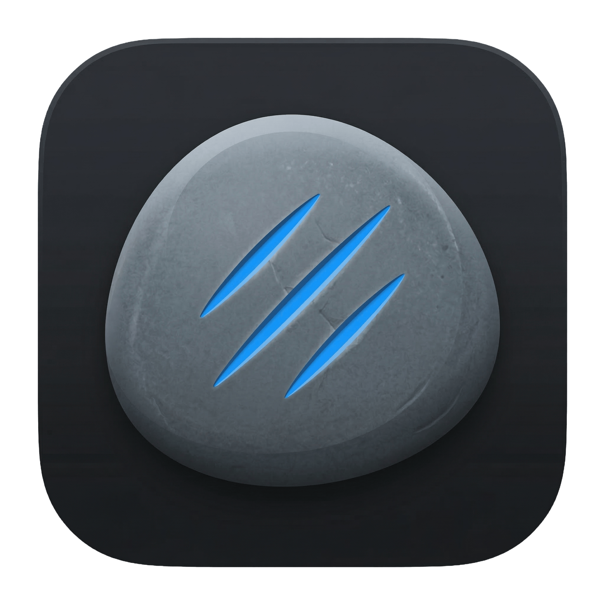

<div align="center">



# Touchstone

**Portable hardware diagnostics for PC repair technicians.**
Run a full diagnostic suite on any Windows, macOS, or Linux machine — no installation required.

[](https://github.com/RJS138/touchstone/actions/workflows/release.yml)
[](https://github.com/RJS138/touchstone/releases/latest)
[](LICENSE)
[](#download)

<br/>


</div>

---

## Set up a USB stick

Pop in a USB drive and run one line. It installs [Ventoy](https://ventoy.net), downloads all platform binaries, and prepares the drive — ready to test any machine you plug it into.

**macOS / Linux**

```bash
sudo bash -c "$(curl -fsSL https://raw.githubusercontent.com/RJS138/touchstone/main/scripts/create_usb.sh)"
```

**Windows** — open PowerShell as Administrator:

```powershell
irm https://raw.githubusercontent.com/RJS138/touchstone/main/scripts/create_usb.ps1 | iex
```

The USB drive will contain ready-to-run executables for every platform. Plug it into any PC and run the binary for that machine's OS — no Python, no dependencies, no internet required on the target machine.

### Updating an existing Ventoy USB

Already have a Touchstone USB? Use `--update` / `-Update` to refresh the binaries without reformatting the drive.

**macOS / Linux**

```bash
sudo bash -c "$(curl -fsSL https://raw.githubusercontent.com/RJS138/touchstone/main/scripts/create_usb.sh)" -- --update
```

**Windows** — open PowerShell as Administrator:

```powershell
irm https://raw.githubusercontent.com/RJS138/touchstone/main/scripts/create_usb.ps1 | iex -Update
```

---

## What it tests

| Category | What's checked |
|---|---|
| **CPU** | Stress test, temperature, core count, clock speed |
| **RAM** | Capacity, speed, userspace pattern scan |
| **Storage** | Sequential read/write speed, SMART health status |
| **GPU** | Model, VRAM, temperature |
| **Display** | Resolution, refresh rate, full-screen colour cycle for dead pixels |
| **Network** | Connectivity, latency |
| **Battery** | Health %, cycle count, charge state |
| **System** | BIOS version, board model, serial number, OS |
| **Manual checks** | LCD, keyboard (every key), touchpad, speakers, USB-A/C, HDMI, webcam |

Each test produces a **pass / warn / fail** result with the raw data captured.

Run a **Before repair** job and an **After repair** job — the app generates a side-by-side comparison report automatically.

---

## Test modes

| Mode | Duration | Use case |
|---|---|---|
| **Quick** | ~5 min | Fast sanity check — intake or quick turnaround |
| **Full** | ~30 min | Thorough stress test — catches intermittent faults |

---

## Reports

After every job the app generates an **HTML report** (and optionally a **PDF**) saved to the USB drive under `reports/<customer>_<job>/`. Reports include every test result, captured hardware data, and technician notes.

A **comparison report** is generated automatically when both a *before* and *after* job exist for the same customer and job number.

---

## Download

Pre-built binaries are attached to every [GitHub Release](https://github.com/RJS138/touchstone/releases/latest). No Python or dependencies needed on the target machine.

| Platform | File |
|---|---|
| Windows x64 | `touchstone_windows_x64.exe` |
| macOS Apple Silicon | `touchstone_macos_arm64` |
| macOS Intel | `touchstone_macos_arm64` (runs via Rosetta 2) |
| Linux x86_64 | `touchstone_linux_x86_64` |

### First-run notes

**macOS** — Gatekeeper will block an unsigned binary on the first run. Remove the quarantine flag:

```bash
xattr -d com.apple.quarantine touchstone_macos_arm64 && ./touchstone_macos_arm64
```

**Linux** — requires root for SMART data and system information:

```bash
chmod +x touchstone_linux_x86_64 && sudo ./touchstone_linux_x86_64
```

**Windows** — right-click `touchstone_windows_x64.exe` → **Run as Administrator**.

---

## Requirements on the target machine

| Tool | Required for | How to get |
|---|---|---|
| `smartctl` | SMART storage health | [smartmontools.org](https://www.smartmontools.org) — or bundled with the binary |
| Admin / root | SMART data, system info, RAM scan | Run as Administrator / sudo |

The app detects missing tools at startup and shows install instructions before proceeding.

---

## Development setup

Requires [UV](https://docs.astral.sh/uv/getting-started/installation/).

```bash
git clone https://github.com/RJS138/touchstone.git
cd automated-computer-testing
uv sync            # creates .venv, installs all dependencies
uv run touchstone  # launch the app
```

### Building from source

```bash
uv sync --group build      # adds PyInstaller

# macOS
bash build/macos/build.sh  # → dist/macos/touchstone_arm64 (or x86_64)

# Linux
bash build/linux/build.sh  # → dist/linux/touchstone_x86_64

# Windows
build\windows\build.bat    # → dist\windows\touchstone_x64.exe
```

Releases are built automatically by [GitHub Actions](.github/workflows/release.yml) when a version tag is pushed:

```bash
git tag v1.0.0 && git push origin v1.0.0
```

---

## License

GPL-2.0 — see [LICENSE](LICENSE).

The `pySMART` dependency is GPL-2.0, which requires this project to be GPL-2.0 as well. All other dependencies are MIT or BSD licensed. PyInstaller is used under its [bootloader exception](https://pyinstaller.org/en/stable/license.html), which permits distributing compiled binaries without the GPL applying to the output.
